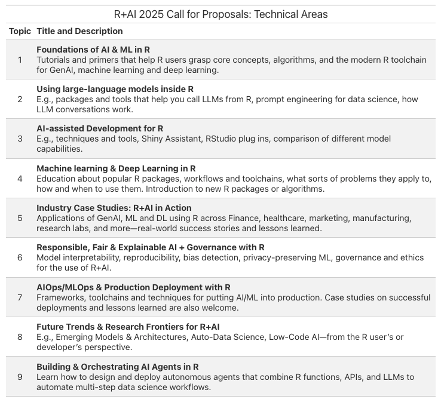

## Submit a proposal

The Call for Proposals for **R+AI 2026** is now open. We want to hear about your experience and specific workflows at the intersection of R and AI—whether you’re just getting started with machine learning, experimenting with large language models in R, leveraging GenAI tools to accelerate your code, deploying AI solutions in industry, or researching deep learning and responsible AI.

<button class="btn btn-rai-mustard" onclick="window.location.href='#'">
  **SUBMIT ABSTRACT** (form coming soon)
</button>

## Key dates

- CFP closes: TBD  
- Notifications: TBD  
- Conference: TBD  

## Example Technical Areas from R+AI 2025

## Formats

- Talks (20–25 min)  
- Lightning talks (5–7 min)  
- Workshops (2–3 hours)  
- Panels (45–60 min)

## Important notes

All speakers are required to adhere to our [Code of Conduct](attend.qmd).

Talks will be recorded and posted to the [R Consortium YouTube channel](https://www.youtube.com/@RConsortium).
