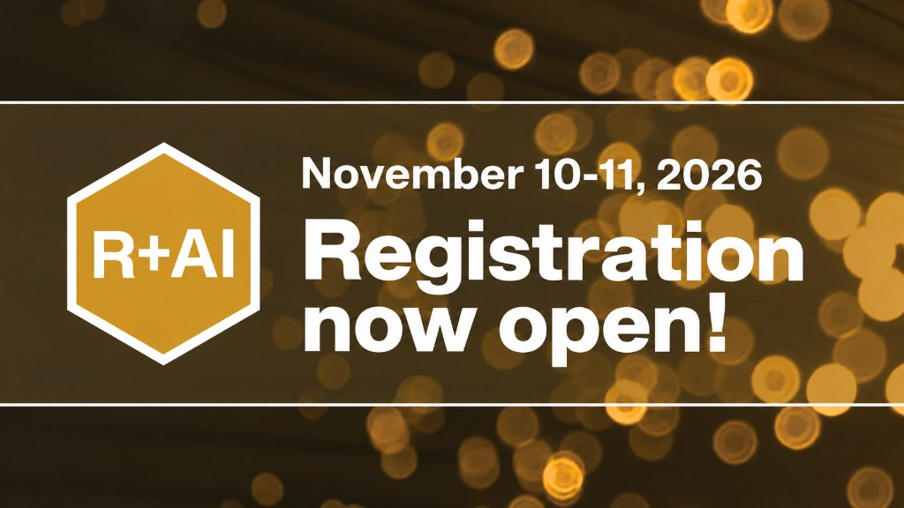

Join us at **R+AI 2026**, the R Consortium conference dedicated to the open-source R community and every facet of artificial intelligence.

This year, R+AI is being held November 10-11, 2026.

Lend your voice to the community! We want to hear about your experience and specific workflows—from machine learning and large language models in R, to AI-assisted coding tools, industry deployments, and responsible AI research.

[Register now!](https://events.zoom.us/ev/AvKPIaFGx9jwfTQyiDQcLmRWjmoDg4b4O20UQLssgTvlWDoXuMh5~AvDbrQHgBmJBUNpTBSMDUTQVfVen6k7w_xlMXZremUKDubDA3Q9AQ7-FRQ){.btn .btn-rai-mustard .btn-rai-lg role="button"}

## About the conference

R+AI brings together practitioners, researchers, and industry teams for talks, lightning talks, workshops, and panels designed to educate, connect, and empower R users at every level.

Conference dates are November 10-11, 2026. Registration is now open.

## R + AI Community Needs Survey

Where is the R community on AI today, and where is it headed? Take this short survey on tools, trust, reproducibility, and real-world workflows. Your responses will help shape R Consortium webinars, working groups, resources, and R+AI 2026 programming.

It takes about 7–10 minutes, and respondents who share an email get early access to the results.

[Learn more and take the survey](survey.qmd){.btn .btn-rai-mustard role="button"}

## Past Events

See the inaugural [R+AI 2025](Events.qmd) program, abstracts, and recordings archive.

## Sponsorships

If you would like to know about sponsorship opportunities, please write to sponsorship@r-consortium.org.
