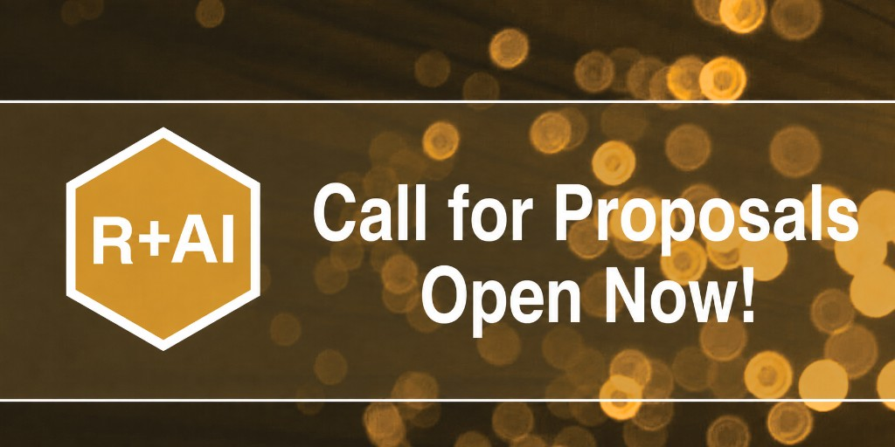

Join us at **R+AI 2026**, the R Consortium conference dedicated to the open-source R community and every facet of artificial intelligence.

## [Call for Proposals — Now Open](cfp.qmd)

Lend your voice to the community. We want to hear about your experience and specific workflows—from machine learning and LLMs in R, to GenAI tooling, industry deployments, and responsible AI research.

<button class="btn btn-rai-mustard" onclick="window.location.href='cfp.qmd'">
  **View the Call for Proposals**
</button>

## About the conference

R+AI brings together practitioners, researchers, and industry teams for talks, lightning talks, workshops, and panels designed to educate, connect, and empower R users at every level.

Conference dates and registration details will be announced soon.

## Past Events

See the inaugural [R+AI 2025](Events.qmd) program, abstracts, and recordings archive.

## Sponsorships

If you would like to know about sponsorship opportunities, please write to sponsorship@r-consortium.org.
